# devmind-fullstack-project

Project Overview:

Beauty Hab is a web application that helps manage appointments across different salons and allows users to have specific roles and functionalities:
Managers: Can create a new salon, add employees to their salon, and add services available in the salon.
Employees: Can view their appointments and cancel them if necessary.
Customers: Can select a salon, service, and employee to schedule an appointment. They can also cancel their appointments.
This app is designed to simplify the process of managing appointments while ensuring each role can manage specific aspects of the platform.

Technologies Used:
Frontend: React
Backend: Spring Boot
Database: MySQL

Features:
Home Page (Public Access)

- Anyone can visit the home page, which displays a list of all available services across salons.
- After selecting a service, users are shown a list of all salons that offer the chosen service.

Salon Details (Requires Login)

- To view the details of a specific salon, users must be logged in.
- If a user isn't logged in, they are redirected to the login or user creation page.
- Upon logging in, the user can view detailed information about the selected salon, including the services offered and available employees.

I. Customers Features:

1. Choose a Service: After logging in, the customer can choose a salon, service, and employee.
2. Pick a Date and Time: Once a service and employee are selected, the app shows available slots for that employee on the chosen day.
3. Create Appointment: The customer selects a time slot, and the appointment is created.
4. Appointments Page: Customers can go to their "My Appointments" page to view all their scheduled appointments.
5. Cancel Appointment: Customers can cancel an appointment from this page if necessary.

II. Manager Features:

1. My Salon Page:

- Managers can access the "My Salon" page.
- If the manager already has a salon, they are redirected to their salon’s page.
- If they don’t have a salon, they can create one by providing necessary details like name, location, etc.

2. Managing Employees and Services:
   Once the salon is created, the manager can:

- Add employees to their salon.
- Set services offered by their salon, including pricing and duration for each service.

III. Employee Features

- View Appointments: Employees can view all their upcoming appointments.
- Cancel Appointments: Employees can cancel appointments if required.

Installation To get the project running locally, follow these steps:

1. Clone the repository https://github.com/roxanamitran/devmind-fullstack-project.git

2. Backend Setup (Spring Boot):

   - Navigate to the backend project folder: cd backend
   - Configure the database connection in src/main/resources/application.properties. Set up your database credentials.
   - Build and run the Spring Boot application: mvn spring-boot:run

3. Frontend Setup (React)

   - Navigate to the frontend folder: cd frontend
   - Install dependencies: npm install
   - Run the React app: npm start

4. Access the application
   The frontend will be available at http://localhost:3000.
   The backend will be available at http://localhost:8080.

Screenshots:

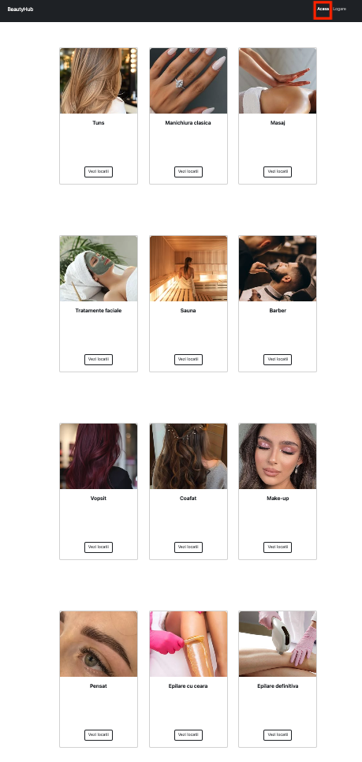
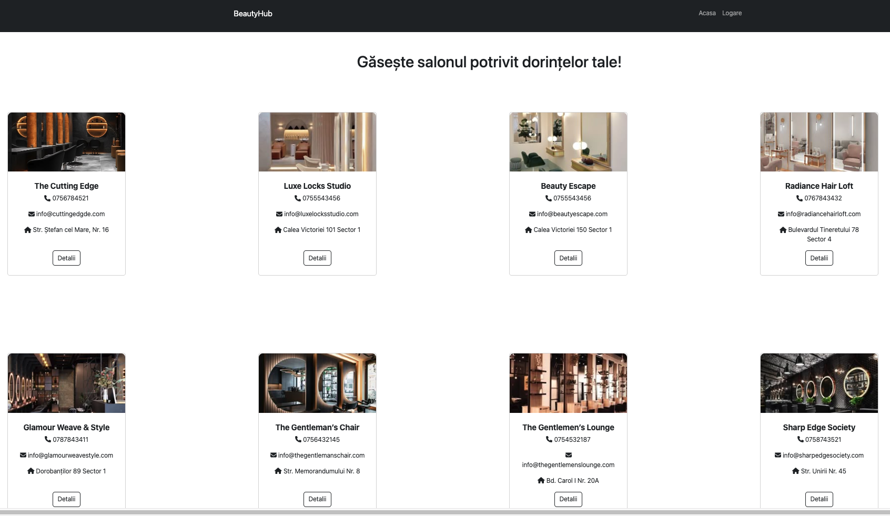
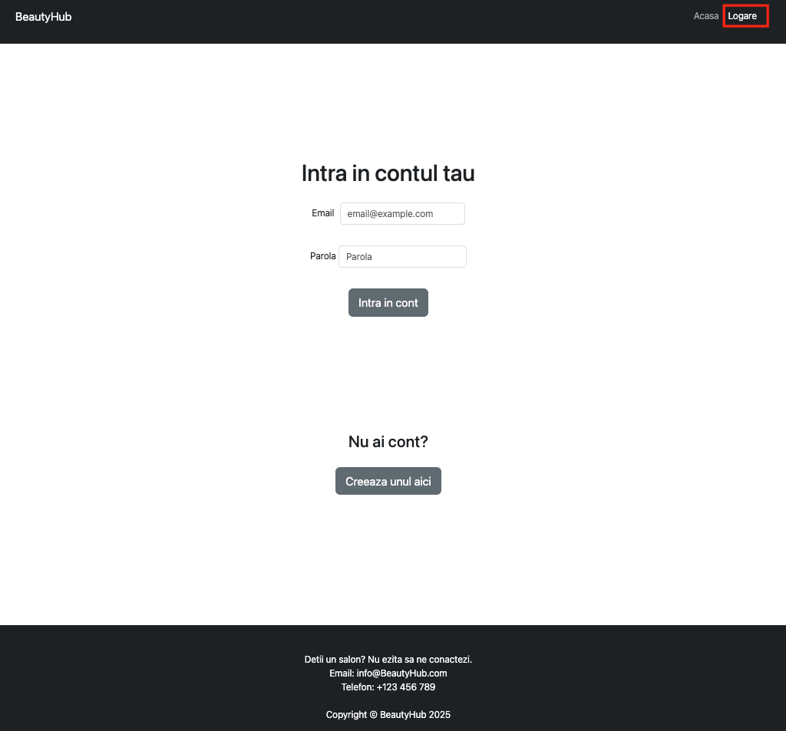
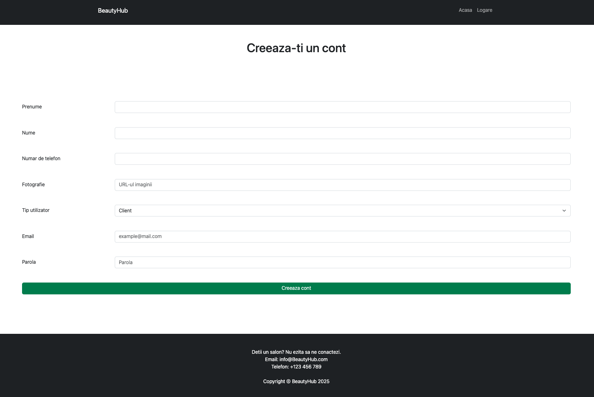
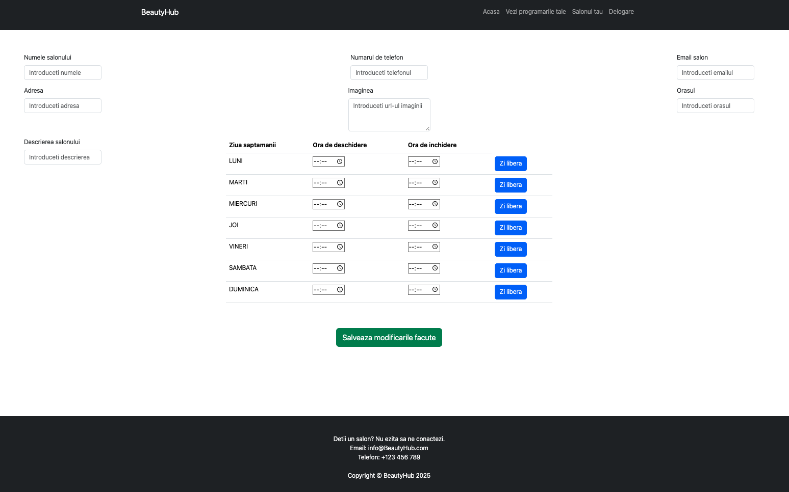
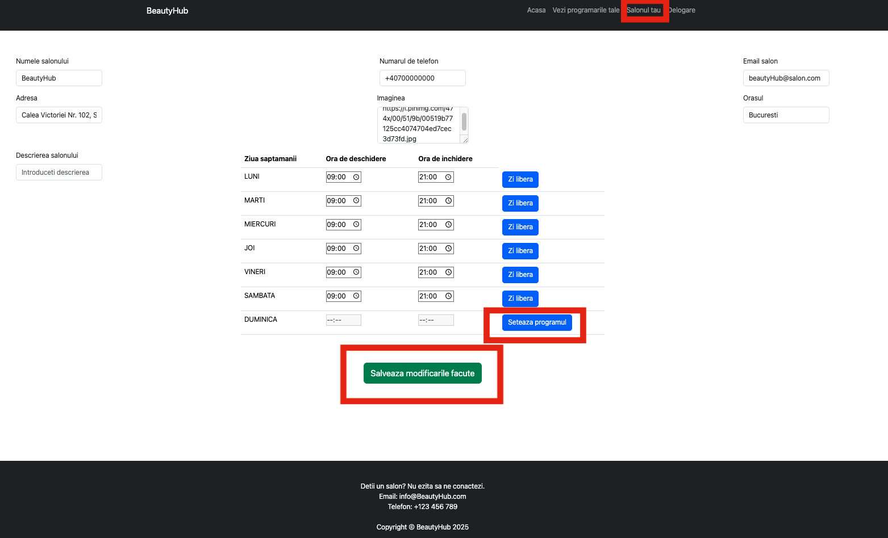
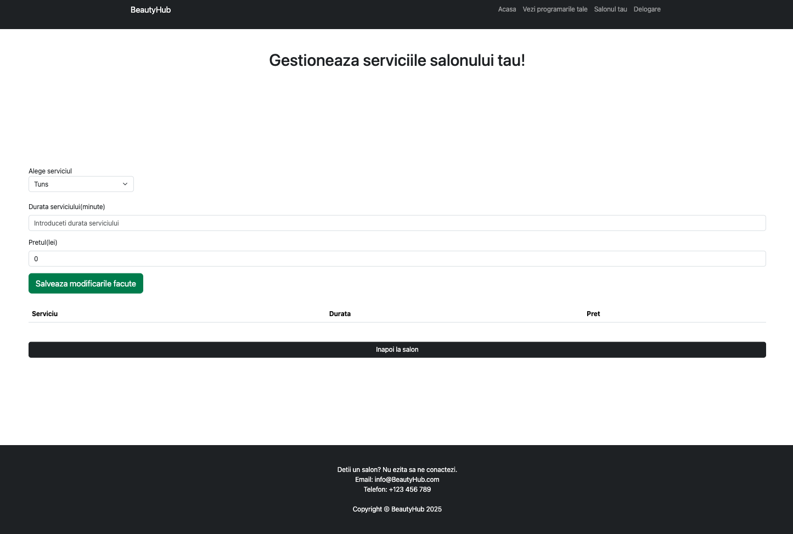
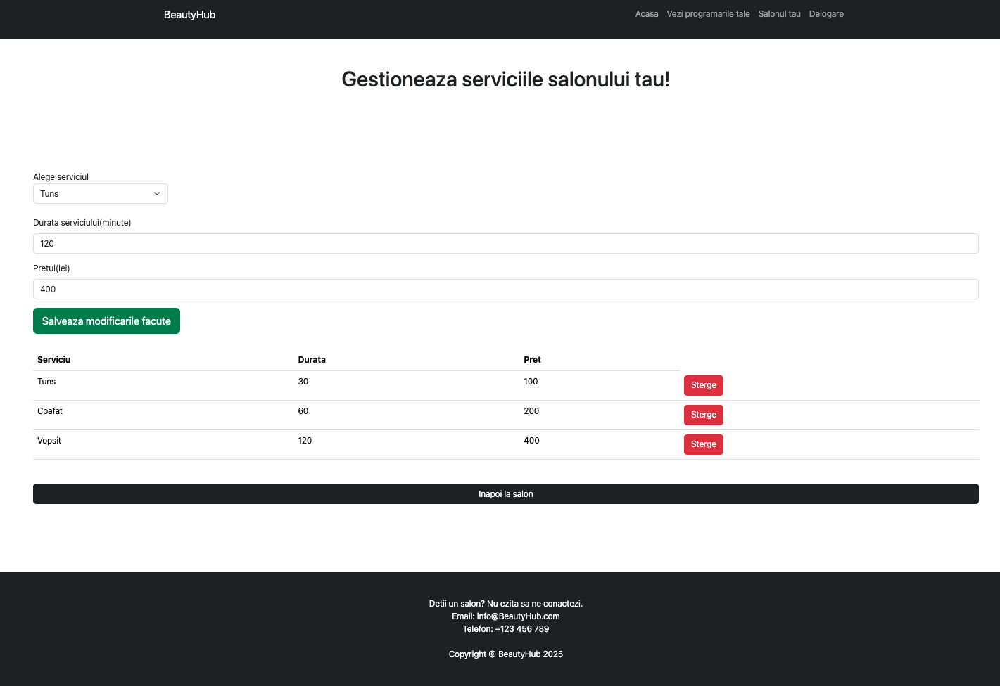
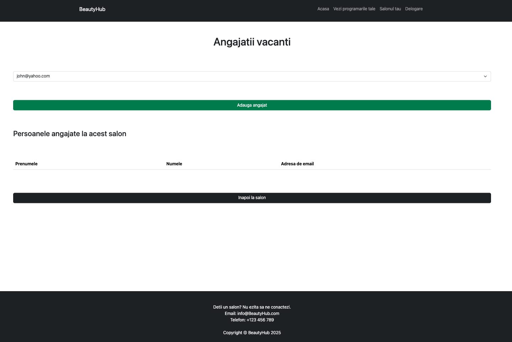
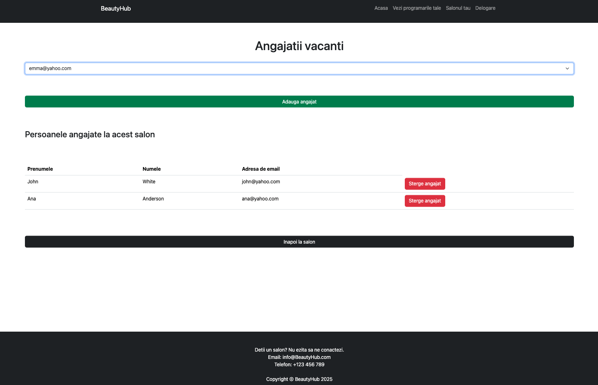
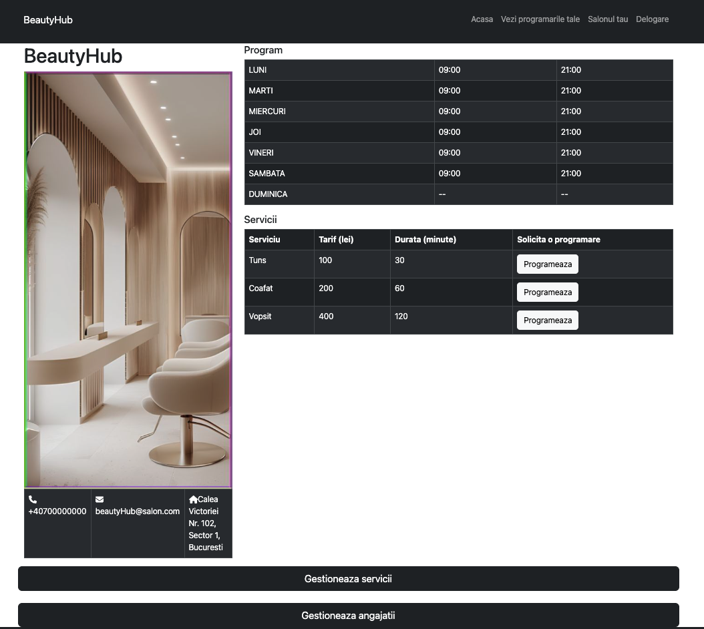
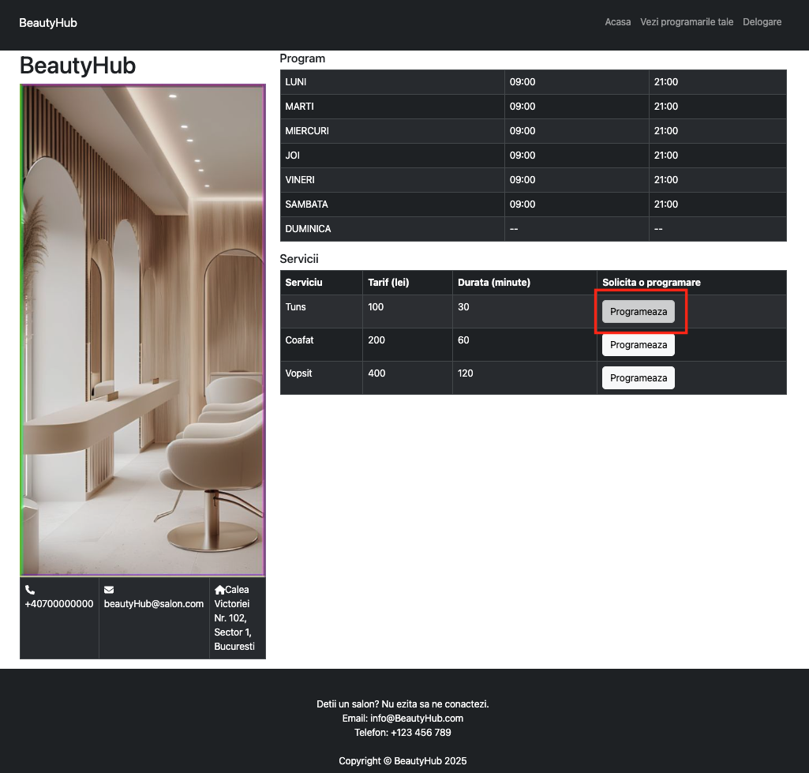
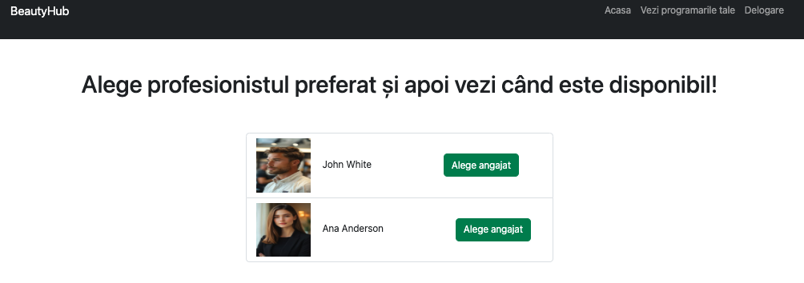
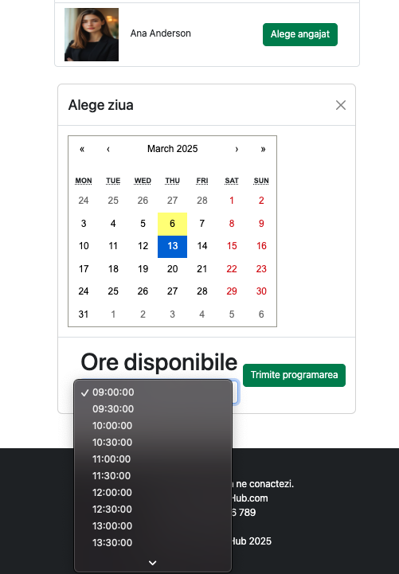
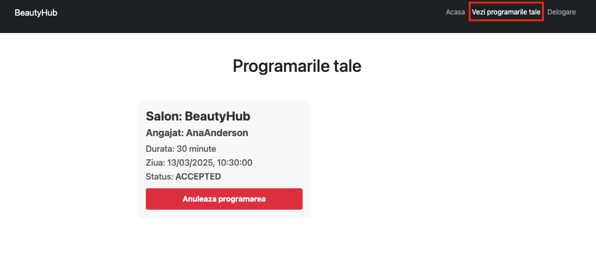
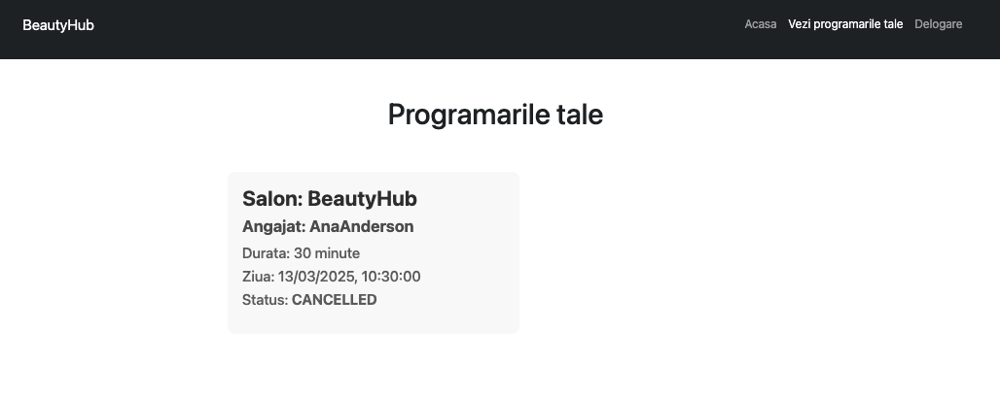
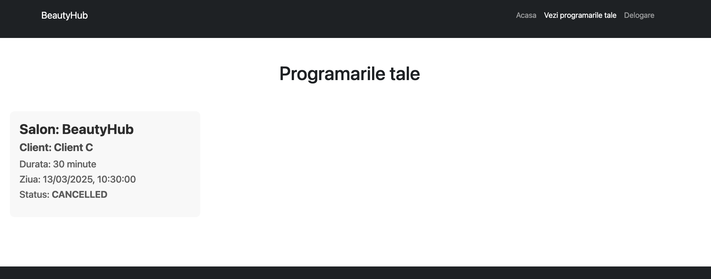
